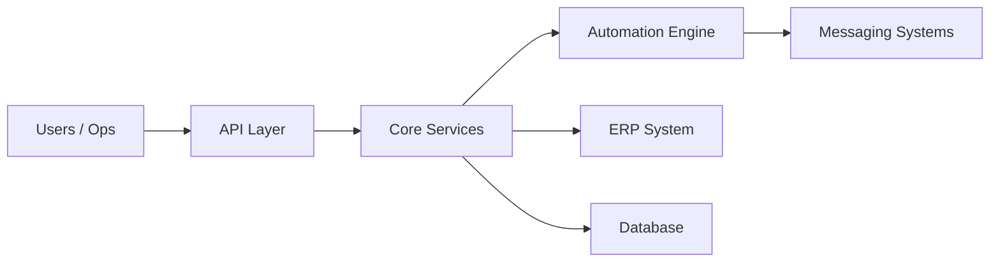

# Mohammad Al Natsheh

## $ whoami

```bash
I build systems that run business operations.

Not features.
Not prototypes.
Production systems.
```

---

## $ capabilities --list

```bash
• Distributed backend systems
• ERP integrations (Business Central)
• Cloud infrastructure (AWS / Azure)
• Automation & event-driven workflows
• Messaging systems (real-time processing)
```

---

## $ architecture --example



---

## $ philosophy

```bash
If the system fails → operations stop.
So I design systems that don't fail.
```

```bash
In production:
reliability > cleverness
```

---

## $ stack

<p align="center">
  
</p>

---

## $ contact

```bash
portfolio:  https://mohammadnatsheh.dev
email:      me@mohammadnatsheh.dev
linkedin:   linkedin.com/in/m0hammadnatsheh
```

---

```bash
> exit

system shutting down...
```
