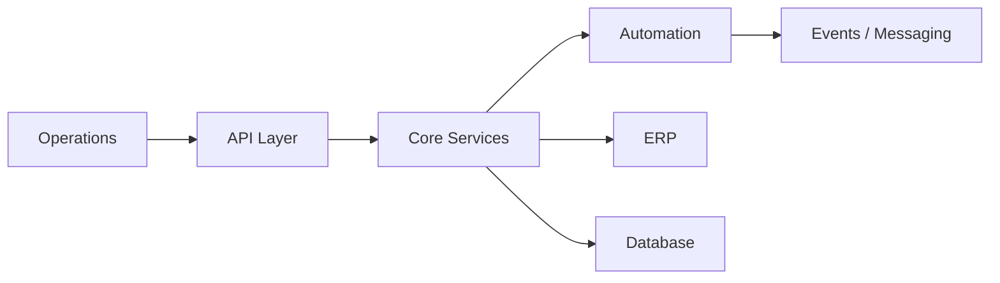

# Mohammad Al Natsheh

**Systems Engineer — Building infrastructure that runs real businesses**

---

## What I Do
I design and build **production systems** that companies depend on daily.

Not experiments.  
Not demos.  
Systems that operate revenue, inventory, and workflows.

---

## Expertise
- Distributed backend systems
- ERP integrations (Dynamics 365 Business Central)
- Cloud architecture (AWS, Azure)
- Event-driven automation
- Real-time systems & messaging

---

## How I Think
- If the system fails → operations stop  
- Reliability is not optional  
- **Simple systems scale. Clever ones break**

---

## Architecture Snapshot

---

## Stack

  

---

## Contact
- 🌐 https://mohammadnatsheh.dev  
- 📧 me@mohammadnatsheh.dev  
- 💼 linkedin.com/in/m0hammadnatsheh
