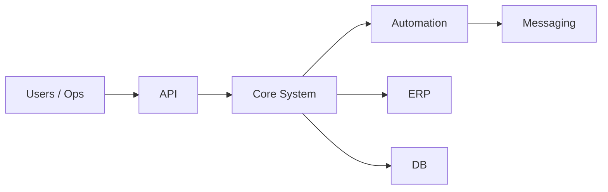

# Mohammad Al Natsheh

<p align="center">
  
</p>

---

## 01 — Identity

```text
Systems Architect / Software Engineer

I don’t build apps.
I build systems that companies depend on.
```

---

## 02 — What That Actually Means

```text
• APIs that don't go down
• Automation that replaces manual work
• ERP integrations that actually work
• Infrastructure that scales without drama
```

---

## 03 — System View



---

## 04 — Signature Thinking

```text
Most engineers ship features.

I design systems where:
if one part fails → everything still works.
```

```text
Because in real businesses:

downtime ≠ bug  
downtime = lost money
```

---

## 05 — Stack

<p align="center">
  
</p>

---

## 06 — Contact

<p align="center">
  <a href="https://mohammadnatsheh.dev/">Portfolio</a> •
  <a href="mailto:me@mohammadnatsheh.dev">Email</a> •
  <a href="https://linkedin.com/in/m0hammadnatsheh">LinkedIn</a>
</p>

---

<p align="center">
  
```text
Build systems. Reduce chaos. Scale operations.
```

</p>
