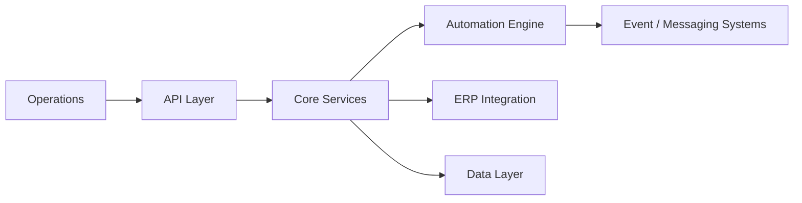

<h1 align="center">Mohammad Al Natsheh</h1>

  Systems Engineer — Building infrastructure that runs real businesses

---

## What I Do
I build **production systems** that companies depend on daily.

- Revenue systems  
- Inventory systems  
- Operational infrastructure  

Not demos. Not prototypes.  
**Real systems that must not fail.**

---

## Core Expertise
- Distributed backend systems
- ERP integrations (Dynamics 365 Business Central)
- Cloud architecture (AWS, Azure)
- Event-driven systems & automation
- Real-time processing & messaging

---

## Engineering Mindset
- If the system fails → business stops  
- Reliability is a requirement, not a feature  
- **Simple systems scale. Clever systems break**

---

## System Design Snapshot

---

## Tech Stack

  

---

## Selected Focus
- ERP-driven business systems  
- Inventory intelligence & operations  
- Automation of real-world workflows  
- High-reliability backend architecture  

---

## Contact
- Portfolio → https://mohammadnatsheh.dev  
- Email → me@mohammadnatsheh.dev  
- LinkedIn → https://linkedin.com/in/m0hammadnatsheh
